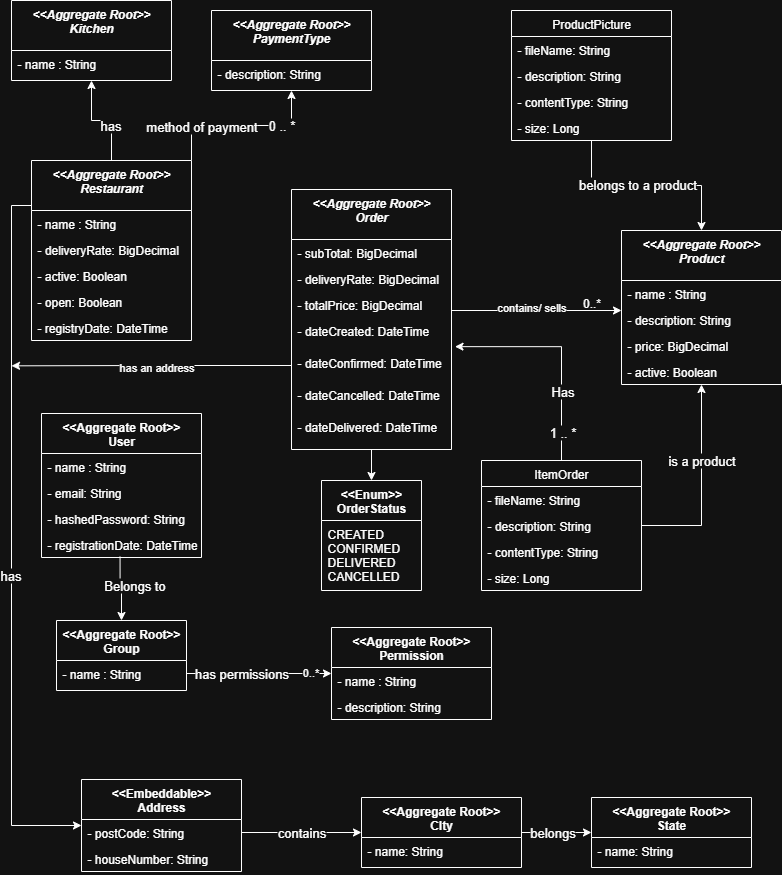

# **Food Ordering & Management API (Spring Boot)**


A **REST API** for managing restaurant-related tasks.  
This project is **a work in progress**, and features will be added progressively.

The goal is to document my learning journey in building **Spring RESTful APIs** following the [Richardson Maturity Model](https://martinfowler.com/articles/richardsonMaturityModel.html).

> If you're a **frontend developer** looking for an API to integrate with—whether to showcase your skills or learn alongside me—feel free to use this API.

---

## **Table of Contents**
- [Features](#features)
- [Tech Stack](#tech-stack)
- [Architecture](#architecture)
- [Class Diagram](#class-diagram)
- [Getting Started](#getting-started)
    - [Database Configuration](#1-database-configuration-mysql-localhost)
    - [Run the Application](#2-run-the-application)
- [API Reference](#api-reference)
- [Example Requests](#example-requests)
- [Roadmap](#roadmap)
- [License](#license)

---

## **Features**

### ✅ Currently Implemented
- CRUD operations for:
    - **Restaurants & Kitchens**
    - **States & Cities**

### 🚧 Upcoming Features
- Global exception handler with standardized request/response formats
- Authentication (Spring Security, JWT, OAuth2)
- Product, Order, Product Photo, Groups, Users, Permissions
- Deployment for public access

---

## **Tech Stack**
- **Java** 17+
- **Spring Boot** (Web, Validation, Data JPA)
- **MySQL** 8+ (local instance)
- Build Tool: **Maven**

---

## **Architecture**

The API is designed with **Domain Driven Design (DDD)** principles, organized into layers:

### **Aggregates**
- **Restaurant**:
    - Owns an **Address**
    - Relates to a **Kitchen**
    - Supports multiple **Payment Methods**
    - Contains **Products** and **Responsible Users**
- **Product**: Has a **ProductPhoto** (filename, description, content type, size)
- **Order**: Linked to a **Restaurant**, **User** (customer), and **Payment Method**; contains **Order Items**
- **User ↔ Group ↔ Permission**: Many-to-many relationship for RBAC
- **City**: Belongs to a **State**

### **Layered Structure**
- `api/` → Controllers, DTOs, Request/Response Models
- `domain/` → Entities, Value Objects, Services, Exceptions
- `infra/` → Repositories, Configuration, Storage Adapters

---

## **Class Diagram**


---

## **Getting Started**

### **1) Database Configuration (MySQL – localhost)**
Ensure MySQL is installed and a database is created.  
Add your configuration to `application.properties`:

```properties
spring.application.name=dbname
spring.datasource.url=jdbc:mysql://localhost/dbname?createDatabaseIfNotExist=true&serverTimezone=UTC
spring.datasource.username=<username>
spring.datasource.password=<password>

spring.jpa.generate-ddl=true
spring.jpa.hibernate.ddl-auto=create
spring.jpa.show-sql=true
```

> **Note:** Hibernate will automatically create the tables on first run.

---

### **2) Run the Application**
Using Maven wrapper:
```bash
./mvnw spring-boot:run
```

---

## **API Reference**

### **Kitchens**
| Method | Endpoint         | Description           |
|--------|------------------|-----------------------|
| GET    | `/kitchens`      | List all kitchens     |
| POST   | `/kitchens`      | Create a kitchen      |
| GET    | `/kitchens/{id}` | Get a kitchen by ID   |
| PUT    | `/kitchens/{id}` | Update a kitchen      |
| DELETE | `/kitchens/{id}` | Delete a kitchen      |

---

### **Restaurants**
| Method | Endpoint             | Description            |
|--------|----------------------|------------------------|
| GET    | `/restaurants`       | List all restaurants   |
| POST   | `/restaurants`       | Create a restaurant    |
| GET    | `/restaurants/{id}`  | Get a restaurant by ID |
| PUT    | `/restaurants/{id}`  | Update a restaurant    |
| DELETE | `/restaurants/{id}`  | Delete a restaurant    |

---

### **States**
| Method | Endpoint         | Description         |
|--------|------------------|---------------------|
| GET    | `/states`        | List all states     |
| POST   | `/states`        | Create a state      |
| GET    | `/states/{id}`   | Get a state by ID   |
| PUT    | `/states/{id}`   | Update a state      |
| DELETE | `/states/{id}`   | Delete a state      |

---

### **Cities**
| Method | Endpoint         | Description         |
|--------|------------------|---------------------|
| GET    | `/cities`        | List all cities     |
| POST   | `/cities`        | Create a city       |
| GET    | `/cities/{id}`   | Get a city by ID    |
| PUT    | `/cities/{id}`   | Update a city       |
| DELETE | `/cities/{id}`   | Delete a city       |

---

## **Example Requests**

### Create a Kitchen
**Request**
```http
POST /kitchens
Content-Type: application/json

{
  "name": "Italian Kitchen"
}
```

**Response**
```json
{
  "id": 1,
  "name": "Italian Kitchen"
}
```

---

### Get All Restaurants
**Request**
```http
GET /restaurants
```

**Response**
```json
[
  {
    "id": 1,
    "name": "Pizza Palace",
    "kitchenId": 1
  },
  {
    "id": 2,
    "name": "Sushi World",
    "kitchenId": 2
  }
]
```

---

## **Roadmap**
- [ ] **Authentication & Authorization** – JWT-based authentication with role-based access control
- [ ] **Pagination, Sorting, Filtering** for all list endpoints
- [ ] **File Storage Abstraction** – Product photos with local/S3 storage
- [ ] **DTOs & Validation** – Standardized request/response models with validation
- [ ] **Database Migrations** – Version-controlled schema changes with Flyway
- [ ] **Caching** – For read-heavy endpoints like kitchens/products
- [ ] **Observability** – Logging, metrics, tracing
- [ ] **Production Configuration** – Secure, profile-based configurations

---

