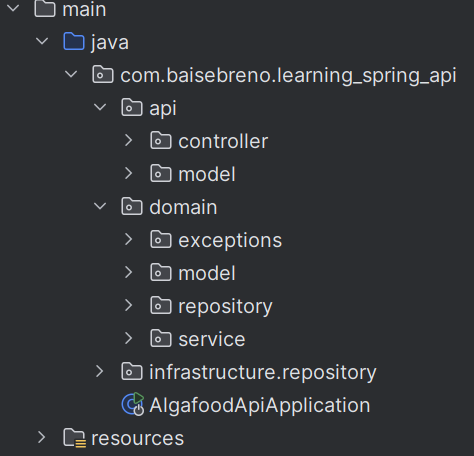
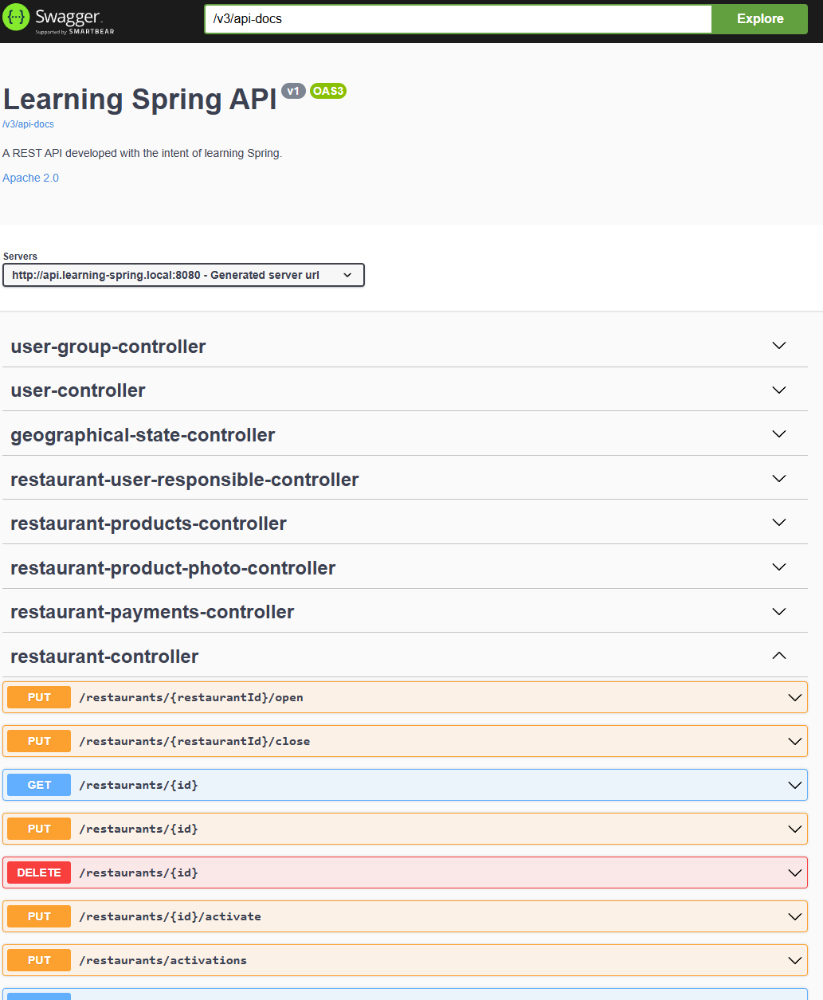

# **Food Ordering & Management API (Spring Boot)**


[](https://brenobaise.github.io/learning-spring-api/)


A **REST API** for managing restaurant-related tasks.  
This project is **a work in progress**, and features will be added progressively.

The goal is to document my learning journey in building **Spring RESTful APIs** following the [Richardson Maturity Model](https://martinfowler.com/articles/richardsonMaturityModel.html).

My future plans are:
- To add Spring Security.
- To add another database provider, like Postgresql
- ~~to add Flyway for database migrations.~~ _Implemented_.
- ~~to add api documentation like Swagger~~ Partly implemented.
> If you're a **frontend developer** looking for an API to integrate with—whether to showcase your skills or learn alongside me—feel free to use this API.

[👉 See Latest Updates (API Reference)](#api-reference) 12/09/25
---

## **Table of Contents**
- [Features](#features)
- [Tech Stack](#tech-stack)
- [Architecture](#architecture)
- [Class Diagram](#class-diagram)
- [Getting Started](#getting-started)
    - [Database Configuration](#1-database-configuration-mysql-localhost)
    - [Run the Application](#2-run-the-application)
- [API Reference](#api-reference)
- [Example Requests](#example-requests)
- [Roadmap](#roadmap)
- [License](#license)

---

## **Features**

### ✅ Currently Implemented
- CRUD operations for:
    - **Restaurants & Kitchens**
    - **States & Cities**
    - **UserGroups & Permissions**
    - **Users & Orders**
    - **Products**

### 🚧 Upcoming Features
- ~~Global exception handler with standardized request/response formats~~ _Implemented_
- Authentication (Spring Security, JWT, OAuth2)
- ~~Product, Order, Product Photo, Groups, Users, Permissions~~ _Implemented_
- Deployment for public access
- TESTS !!! 

- ~~Javadocs for implemented classes.~~ OpenAPI docs implemented and Swagger UI.
> **Note:** I recently started uploading this project to GitHub. I had no initial plans to share it, but decided to start somewhere—therefore, not all classes are documented yet.

---

## **Tech Stack**
- **Java** 17+
- **Spring Boot** (Web, Validation, Data JPA)
- **MySQL** 8+ (local instance)
- Build Tool: **Maven**

---

## **Architecture**

The API is designed with **Domain Driven Design (DDD)** principles, organized into layers:

### **Aggregates**
- **Restaurant**:
    - Owns an **Address**
    - Relates to a **Kitchen**
    - Supports multiple **Payment Methods**
    - Contains **Products** and **Responsible Users**
- **Product**: Has a **ProductPhoto** (filename, description, content type, size)
- **Order**: Linked to a **Restaurant**, **User** (customer), and **Payment Method**; contains **Order Items**
- **User ↔ Group ↔ Permission**: Many-to-many relationship for RBAC
- **City**: Belongs to a **State**

### **Layered Structure**
- `api/` → Controllers, DTOs, Request/Response Models
- `domain/` → Entities, Value Objects, Services, Exceptions
- `infra/` → Repositories, Configuration, Storage Adapters


---

## **Class Diagram**


---

## **Getting Started**
> **Note:** Eventually I will update this to a more thorough explanation of how to get a database working.
> Also, I plan to migrate to Postgres.

### **1) Database Configuration (MySQL – localhost)**
Ensure MySQL is installed and a database is created.  
Add your configuration to `application.properties`:

```properties
spring.application.name=dbname
spring.datasource.url=jdbc:mysql://localhost/dbname?createDatabaseIfNotExist=true&serverTimezone=UTC
spring.datasource.username=<username>
spring.datasource.password=<password>

spring.jpa.generate-ddl=true
spring.jpa.hibernate.ddl-auto=create
spring.jpa.show-sql=true
```

> **Note:** ~~Hibernate will automatically create the tables on first run.~~
>
> As of [Commit b3fb9f5](https://github.com/brenobaise/learning-spring-api/commit/b3fb9f5e17eac6122d79f1cd18b40e1806eabd0d) Flyway is now takes control of table creation and test data. 

> **Note:** ~~I have also provided a `import.sql` file to generate some data into the database, feel free to play around with it.~~ <br>
>
> As of [Commit b3fb9f5](https://github.com/brenobaise/learning-spring-api/commit/b3fb9f5e17eac6122d79f1cd18b40e1806eabd0d) `afterMigrate.sql` generates test data automatically.
---

### **2) Run the Application**
Using Maven wrapper:
```bash
./mvnw spring-boot:run
```

---

## **API Reference**

This project uses **Swagger / OpenAPI** for API documentation.  
👉 [Interactive API Docs](https://brenobaise.github.io/learning-spring-api/)

I have added SpringDoc and SwaggerUI to the project with the intent of having a visual demonstration of the current possibilities of the API.
Since it's a work in progress, as I go through the code I will add more documentation for the API docs.


### Example Endpoints
- **Kitchens**
    - `GET /kitchens` – List all kitchens
    - `POST /kitchens` – Create a kitchen
- **Restaurants**
    - `GET /restaurants` – List all restaurants
    - `POST /restaurants` – Create a restaurant


## **Example Requests**

### Create a Kitchen
**Request**
```http
POST /kitchens
Content-Type: application/json

{
  "name": "Italian Kitchen"
}
```

**Response**
```json
{
  "id": 1,
  "name": "Italian Kitchen"
}
```

---

### Get All Restaurants
**Request**
```http
GET /restaurants
```

**Response**
```json
[
  {
    "id": 1,
    "name": "Pizza Palace",
    "kitchenId": 1
  },
  {
    "id": 2,
    "name": "Sushi World",
    "kitchenId": 2
  }
]
```

---

## **Roadmap**
- [ ] **Authentication & Authorization** – JWT-based authentication with role-based access control
- [X] **Pagination, Sorting, Filtering** for all list endpoints
- [X] **File Storage Abstraction** – Product photos with local/S3 storage
- [X] **DTOs & Validation** – Standardized request/response models with validation
- [X] **Database Migrations** – Version-controlled schema changes with Flyway
- [X] **Caching** – For read-heavy endpoints like kitchens/products
- [ ] **Observability** – Logging, metrics, tracing
- [ ] **Production Configuration** – Secure, profile-based configurations

---

